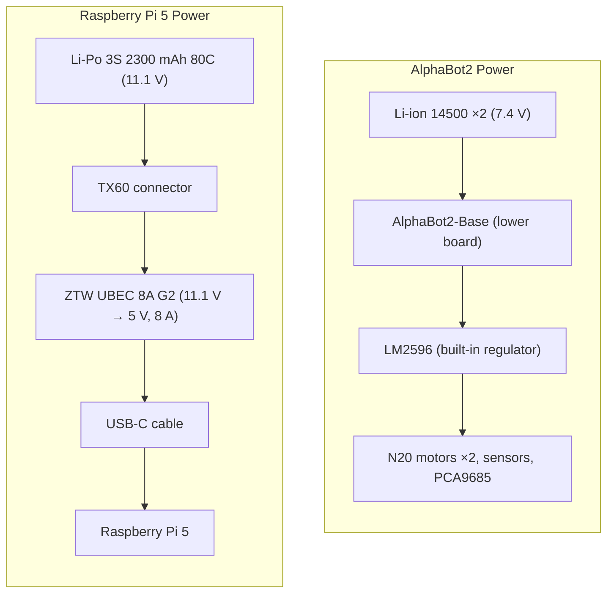
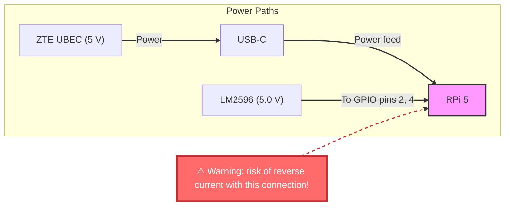

# Stage 1 - Initial architecture

**Version:** 1.0  
**Date:** August 1, 2026  

## 1.1 - Platform

| Parameter | Value |
|----------|----------|
| **Chassis** | AlphaBot2-Pi (Waveshare), 2 decks |
| **Compute** | Raspberry Pi 5, 2 GB RAM 📌|
| **Storage** | SanDisk Extreme Pro A2 256 GB MicroSD |
| **OS** | Ubuntu 24.04 Server (64-bit) |
| **ROS 2** | Jazzy (ros-base) |
| **DDS** | CycloneDDS (Domain 42) |
| **I2C** | Enabled (`dtparam=i2c_arm=on`) |
| **GPIO libraries** | gpiozero (primary), smbus2 (I²C), spidev (SPI) |

> 📌 **Note:**
> according to the technical specifications, the AlphaBot2‑Pi can originally be equipped with Raspberry Pi 3B/3B+/4B single‑board computers [see here](https://www.waveshare.com/product/raspberry-pi/robots/mobile-robots/alphabot2-pi-acce-pack.htm). However, in 2026, with the Raspberry Pi 5 already in production, purchasing an older model is not very practical. Therefore, the decision was made to use the Raspberry Pi 5 with 2 GB of RAM, and the consequences of this choice will be described further below.

## 1.2 - Boards

| Board | Location | Chips | Functions |
|-------|:------------:|------|---------|
| **AlphaBot2-Base** 👇| Bottom | TB6612FNG, LM393, ST188 ×3, ITR20001/T ×5, WS2812B ×4 | Motors, sensors, LEDs |
| **AlphaBot2-Pi** 👇| Top | PCA9685, TLC1543, CP2102, LM2596 | Servo controller, ADC, UART, regulator, joystick, IR receiver, buzzer |
| **FC-20P cable** | Between boards | — | AlphaBot2-Base ↔ AlphaBot2-Pi connection |

> 👉 **Links:** 
> details for **Waveshare's AlphaBot2-Base** and **Waveshare's AlphaBot2-Pi** see [here](https://www.waveshare.com/wiki/AlphaBot2-Pi#AlphaBot2-Base) and
 [here](https://www.waveshare.com/wiki/AlphaBot2-Pi#AlphaBot2-Pi)

#### **Figure 1.1, 1.2** Waveshare's initial platform architecture

---

# Stage 2 - Raspberry Pie Gone Wrong

**Version:** 2.0  
**Date:** August 10-30, 2026  

---

## Step 2.1 — Reinforcing the pie

According to the Raspberry Pi 5 docs, running it without cooling is a no‑go — so I got a case with two fans.

#### **Figure 2.1** Raspberry Pi 5 in its case.

---

## Step 2.2 — Adding the filling

But of course, no good deed goes unpunished 😅. Here’s the catch: the case is just a bit too thick. Because of that, the GPIO pins on the Pi couldn’t line up with the AlphaBot2‑Pi board’s connectors — the case kept bumping into the board’s components and blocking the connection.

#### **Figure 2.2** GPIO alignment problem
> The Raspberry Pi 5 case is too thick to let the pins connect cleanly to the AlphaBot2‑Pi board.
> As you can see, the case frame presses against the nearby components on the AlphaBot board, so the GPIO pins can’t fully seat into their sockets. That’s why we can’t get a proper connection. 🔌❌

---

I fixed the problem with a straightforward solution: a GPIO pin extender. But, of course, the universe decided to test my patience — this little piece of polymer and metal had to travel all the way from China, and I spent 20 days waiting for it to arrive. 😅

#### **Figure 2.3** The fix: a GPIO extender solves the alignment problem
>The little piece of polymer and metal did the trick: now the Raspberry Pi 5 connects cleanly to the AlphaBot2‑Pi board, and there’s still enough clearance for proper airflow and cooling. ✅

---

## Step 2.3 — Raising the sourdough

“Well, now it’s definitely going to work!” — I thought to myself. But the pie just wouldn’t fold. The GPIO extender, together with the Raspberry Pi case, increased the overall height of the top‑plate assembly. As a result, there was now a noticeable gap between the plate and the PCB standoffs.

#### **Figure 2.4** Increased stack height causing misalignment with standoffs.
>The addition of the GPIO header extender and the Raspberry Pi 5 case increased the overall height of the upper assembly. This resulted in a gap between the top plate and the standoffs, preventing proper mechanical alignment.

---

## Step 2.4 — Done!

It then became clear that the design needed to be modified: I had to lengthen the hex standoffs. And since the distance between the platforms was changing anyway, I could put this to good use — by adding an ultrasonic distance sensor (HC‑SR04).

After all these adjustments, the AlphaBot looked a bit… melancholy, but it held high hopes for its future.

#### **Figure 2.5** AlphaBot2‑Pi after mechanical revision: extended standoffs + HC‑SR04.
> Standoff lengthening (indicated by red arrows) corrected the issue; the additional space was leveraged to add an ultrasonic distance sensor.

---

# Stage 3 - From AlphaBot to AlphaBattCarrier

**Version:** 3.0  
**Date:** September 1-20, 2026  

---

## Step 3.1 — Testing

Well, finally, the time for testing has come [see here](https://github.com/al-sapsan/AlphaBot/blob/main/docs/boards-assembly.md). After running all the tests and seeing that the system was fully functional, I hit a pretty significant problem for me: I could only test for 20–25 minutes at most. Even with the mildest, unloaded testing, the charge of the two 14500 batteries would catastrophically run out.

The reason was that the AlphaBot2‑Pi board was originally designed by the manufacturer to be used with the third or, at most, fourth model of Raspberry Pi — which are much more energy‑efficient than the fifth model. And this is even considering the fact that only the single‑board computer was being tested, while the chassis remained motionless and practically unloaded on the test bench. If you were to make this contraption actually move — i.e., do what it’s actually meant to do — the battery would last a maximum of 10 minutes. As they say in Russia: «Such hockey we don’t need!»

To solve this issue, the following power scheme was initially chosen:

But problems arose here too. On the 40‑pin connector of the Raspberry Pi (RPi11 on AlphaBot2‑Pi), **pins 2 and 4** are **+5V lines**. In the standard AlphaBot2‑Pi circuit, they were used to **supply power to the RPi** from the LM2596 (via the FC‑20P ribbon cable from the lower board) [see Waveshare's scheme for details](https://github.com/al-sapsan/AlphaBot/blob/main/docs/datasheets/AlphaBot2-Base-Schematic.pdf).

#### Figure 3.1. Pins 2 and 4 used to **supply power to RPi**.
> The blue-red crosses mark pins 2 and 4 that will need to be removed. Why? Read on 👇

---

### Issue 1: Conflict of two power sources

After installing UBEC (USB‑C → RPi 5), the RPi 5 receives power **directly via USB‑C**. If pins 2 and 4 were still connected to the LM2596, there would be a **reverse current‼️** between the two 5V sources:

**⚠️ Consequences of reverse current:**
* Damage to the RPi 5 power circuits.
* Damage to the LM2596.
* Unstable operation (two sources «fight» for voltage).
* Risk of fire 🔥

### Issue 2: RPi 5 can’t get 5A via GPIO

Pins 2 and 4 on the 40‑pin connector are rated for **a current of up to 1A** (according to the specs). The RPi 5 requires **up to 5A** — that’s 5 times more than the allowable current via GPIO.

| Power path | Max current | Suitable for RPi 5? |
|--------------|:---------:|:-------------------:|
| **GPIO pins 2, 4** | ~1A | ❌ No |
| **USB‑C** | 5A | ✅ Yes |

### Issue 3: Official Raspberry Pi Foundation recommendation

The Raspberry Pi Foundation **doesn’t recommend** powering the RPi 5 via GPIO at high currents. The official way is **USB‑C** (5V/5A, 27W).

### Solution:
Disconnect (remove) pins 2 and 4 to prevent reverse current damage to the RPi 5 power circuitry. Use power via USB‑C.

## Step 3.2 — Removing the pins

**Physically:** pins 2 and 4 were removed by literally yanking them out 😀 from the RPi11 connector (40‑pin GPIO).
**Result:** the RPi 5 no longer receives power from the LM2596 via GPIO. Power comes only via USB‑C from the XH‑M404.

#### Figure 3.2. GPIO extender after dental surgery.
> The blue-red arrows indicate the sites of dental surgical procedures to remove pins 2 and 4 🦷

---

## Step 3.3 — Soldering the circuit

I’ve made the decision — I’m going to do it. Done.

#### Figure 3.3. Soldered TX60F to ZTE UBEC.
> The corresponding interface connectors were soldered to the voltage converter — now I’ve got to test this whole mess.

---

And as usual, testing was carried out afterwards.

#### Figure 3.4. Output voltage readings from ZTE UBEC.
> Here we go again! Of course, I could try to fix all this with a resistor or a Schottky diode 🤔. But somehow I’m not feeling up to it…

---

And what do we see? The UBEC in use was outputting **5.261 V**, which didn’t suit me at all, because:

1. The Raspberry Pi 5 Product Brief (document with code RP‑008348‑DS) specifies the basic requirement as «5V/5A DC power via USB‑C, with Power Delivery support» [see here](https://github.com/al-sapsan/AlphaBot/blob/main/docs/datasheets/RP-008348-DS-6-raspberry-pi-5-product-brief.pdf).
2. The Raspberry Pi Compute Module 5 clearly indicates the acceptable voltage range for the main power supply (in the electrical characteristics table, lines 77/83/85/86) as «4.75 V to 5.25 V; main power input» [see here](https://github.com/al-sapsan/AlphaBot/blob/main/docs/datasheets/RP-008180-DS-7-cm5-datasheet.pdf).

3. The official «Raspberry Pi computer hardware» documentation (Power supply section) confirms that booting requires a source capable of delivering a stable 3 A at +5 V (15 W), and for full performance and removing peripheral limitations, you need a 5 A source at +5 V (25–27 W) [see here](https://www.raspberrypi.com/documentation/computers/raspberry-pi.html).

Thus, when designing your own power circuits for the Raspberry Pi 5, you need to ensure a stable voltage in the range of 4.75 V to 5.25 V, with the power source capable of delivering up to 5 A without dropping below the minimum threshold.

## Step 3.4 — Fixing what was done

I needed to come up with a new power scheme. Since buying a new UBEC might give me the same result as the previous one, it logically follows that I needed to get a step‑down voltage converter with a built‑in regulator. I chose the XH‑M404 4016E, because: 
* The ZTW UBEC gives **5.261V** (exceeding the maximum allowable voltage);
* The XH‑M404 4016E can be set precisely to **5.1V**;
* The XH‑M404 4016E has **8A** (reserve for peak loads of the RPi 5);
* The XH‑M404 4016E has **OVP** (overvoltage protection).

The XH‑M404 4016E also had a significant plus — a digital voltmeter — but also a significant minus — it is really huge. It became the next architectural add‑on over the main robot boards.

## Step 3.5 — Looking at the result

After installing all this electrical mess, the AlphaBot logically transformed into the AlphaBattCarrier.

#### Figure 3.5. Monumental construction 😂
> I’ve got a feeling this won’t be the last modification to the design. Do you feel the same?
